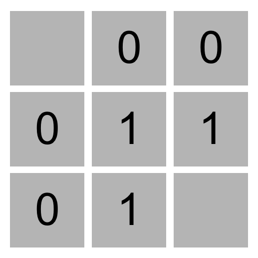

# CS50AI Introduction to Artificial Intelligence with Python

## 0. Search
### Project 1a Degrees:
Write a program that determines how many “degrees of separation” apart two actors are.
```
$ python degrees.py large
Loading data...
Data loaded.
Name: Emma Watson
Name: Jennifer Lawrence
3 degrees of separation.
1: Emma Watson and Brendan Gleeson starred in Harry Potter and the Order of the Phoenix
2: Brendan Gleeson and Michael Fassbender starred in Trespass Against Us
3: Michael Fassbender and Jennifer Lawrence starred in X-Men: First Class
```
#### Background:
According to the *[Six Degrees of Kevin Bacon game](https://en.wikipedia.org/wiki/Six_Degrees_of_Kevin_Bacon)*, anyone in the Hollywood film industry can be connected to Kevin Bacon within six steps, where each step consists of finding a film that two actors both starred in.

In this problem, we’re interested in finding the shortest path between any two actors by choosing a sequence of movies that connects them. For example, the shortest path between Jennifer Lawrence and Tom Hanks is 2: Jennifer Lawrence is connected to Kevin Bacon by both starring in “X-Men: First Class,” and Kevin Bacon is connected to Tom Hanks by both starring in “Apollo 13.”

We can frame this as a search problem: our states are people. Our actions are movies, which take us from one actor to another (it’s true that a movie could take us to multiple different actors, but that’s okay for this problem). Our initial state and goal state are defined by the two people we’re trying to connect. By using breadth-first search, we can find the shortest path from one actor to another.

### Project 1b Tic-Tac-Toe:
Using *Minimax*, implement an AI to play Tic-Tac-Toe optimally.
<p align="center"></p>
#### Usage:
```
$ python runner.py
```

## 1. Knowledge
### Project 1a Knights:
Write a program to solve logic puzzles.
#### Background:
In 1978, logician Raymond Smullyan published “What is the name of this book?”, a book of logical puzzles. Among the puzzles in the book were a class of puzzles that Smullyan called “Knights and Knaves” puzzles.

In a Knights and Knaves puzzle, the following information is given: Each character is either a knight or a knave. A knight will always tell the truth: if knight states a sentence, then that sentence is true. Conversely, a knave will always lie: if a knave states a sentence, then that sentence is false.

The objective of the puzzle is, given a set of sentences spoken by each of the characters, determine, for each character, whether that character is a knight or a knave.

For example, consider a simple puzzle with just a single character named A. A says “I am both a knight and a knave.”

Logically, we might reason that if A were a knight, then that sentence would have to be true. But we know that the sentence cannot possibly be true, because A cannot be both a knight and a knave – we know that each character is either a knight or a knave, but not both. So, we could conclude, A must be a knave.

That puzzle was on the simpler side. With more characters and more sentences, the puzzles can get trickier! Your task in this problem is to determine how to represent these puzzles using propositional logic, such that an AI running a model-checking algorithm could solve these puzzles for us.
#### Usage:
```
$ python puzzle.py
```

### Project 2b Minesweeper:
Write an AI to play Minesweeper.
<p align="center"></p>
#### Background:
Minesweeper is a puzzle game that consists of a grid of cells, where some of the cells contain hidden “mines.” Clicking on a cell that contains a mine detonates the mine, and causes the user to lose the game. Clicking on a “safe” cell (i.e., a cell that does not contain a mine) reveals a number that indicates how many neighboring cells – where a neighbor is a cell that is one square to the left, right, up, down, or diagonal from the given cell – contain a mine.

In this 3x3 Minesweeper game, for example, the three 1 values indicate that each of those cells has one neighboring cell that is a mine. The four 0 values indicate that each of those cells has no neighboring mine.

<p align="center"></p>

Given this information, a logical player could conclude that there must be a mine in the lower-right cell and that there is no mine in the upper-left cell, for only in that case would the numerical labels on each of the other cells be accurate.

The goal of the game is to flag (i.e., identify) each of the mines. In many implementations of the game, including the one in this project, the player can flag a mine by right-clicking on a cell (or two-finger clicking, depending on the computer).
#### Usage:
```
python runner.py
```


